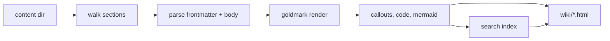

# Rendering pipeline

Rendering is a single pass with no external process at request time.

1. **Walk.** The content directory is read. Root Markdown files form one
   section; each subdirectory is a section. Section order and titles come from
   `--sections`, with any unlisted directory appended alphabetically.
2. **Parse.** Each file is split into frontmatter and body. The body is parsed
   with goldmark (CommonMark plus tables, task lists, footnotes). Heading ids
   are assigned from the heading text, and an on-page table of contents is
   collected from levels two and three.
3. **Transform.** Fenced code is highlighted with Chroma (a fixed dark theme).
   GitHub alert blockquotes (`> [!NOTE]`) become callout cards. Mermaid fences
   pass through as `<pre class="mermaid">` for the browser to render.
4. **Index.** Each page is split into heading-anchored text chunks and written
   to `search-index.json`, which the client search modal loads on first use.
5. **Emit.** Pages are written under the base path, followed by the resolved
   theme's assets (stylesheet, fonts, tokens, the search and diagram clients,
   favicon), the optional Mermaid vendor bundle, and a `theme.json` recording
   which theme produced the output.

## Themes

A theme is resolved once, before any page is rendered, and the result is
fingerprinted into the `?v=` query on every asset link. Two renders of the same
bundle under different themes therefore differ in that hash, which is what makes
a theme change reach the browser. See
[`reference/themes.md`](../reference/themes.md).

## Links

A relative link that stays inside the bundle becomes a link to the rendered
page. A link that escapes the bundle (for example `../../roles/x.yml`) becomes a
`/repo/...` link when `--repo` is set, served from a read-only mount of the
repository root. Without `--repo` the original relative link is kept.

## Caching

Every page links its stylesheet and scripts with a content-hash `?v=` query, and
the server sends `Cache-Control: no-cache`. A re-render therefore always reaches
the browser, which matters while authoring. The hash covers the resolved theme's
bytes, so an override that changes a stylesheet busts the cache even though the
file name is the same.
