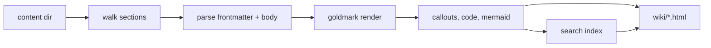

# Rendering pipeline

Rendering is a single pass with no external process at request time.

1. **Walk.** The content directory is read. Root Markdown files form one
   section, and each subdirectory under the root is a section, in that order and
   titles from `--sections`, with any unlisted directory appended
   alphabetically. An unlisted directory's title is its name with hyphens and
   underscores turned into spaces and the first letter of each word upper-cased,
   which is done by character rather than by byte so a non-ASCII name titles
   itself correctly. A directory inside a section is not a section of its own:
   its pages belong to the section above and keep the path in their slug, so
   `guide/setup/install.md` in a `guide` section is served at
   `/wiki/guide/setup/install.html`. Markdown is collected at any depth. Files
   and directories whose name begins with a dot are skipped, so a bundle that is
   also a working tree does not render its own `.git`.
2. **Parse.** Each file is split into frontmatter and body. The body is parsed
   with goldmark (CommonMark plus tables, task lists, footnotes). Heading ids
   are assigned from the heading text and made unique within the page. An on-page
   table of contents collects level two only, though every heading still gets
   an id. Level-two headings grow a `#` permalink on hover.
3. **Transform.** Fenced code is highlighted with Chroma into `pre.code.chroma`,
   with a `language-*` class naming the language. A fence with no language is
   escaped into `pre.code` and left unhighlighted. GitHub alert blockquotes
   (`> [!NOTE]`) become callout cards. Mermaid fences pass through as
   `<pre class="mermaid">` for the browser to render.

   The browser draws each diagram into a card: a toolbar naming the type with
   a copy and an expand affordance, then the drawing in a scroll area. Every
   type renders at one size, at natural width, so a wide diagram scrolls
   sideways rather than shrinking its labels; the card caps the height at
   560px so a tall one scrolls instead of taking the page. Full screen opens
   a wide diagram at its natural size and closes on Escape or a click on the
   field around it. A diagram that will not parse becomes a red card carrying
   the parser's message and the source, so the mistake is readable where it
   is written rather than an empty block.
4. **Index.** Each page is split into heading-anchored text chunks and written
   to `search-index.json`, which the client search modal loads on first use.
   Tags are collected into `tags.json`, a catalogue of display name, tag page
   URL and page count, which the modal fetches only for hash-prefixed queries.
5. **Emit.** In order: the pages, one tag page per tag under `tags/`, the
   bundle's own non-Markdown files, the resolved theme's assets (stylesheet,
   fonts, tokens, the search and diagram clients, favicon), the Mermaid vendor
   bundle when the bundle has a diagram, `search-index.json`, `tags.json`, and
   a `theme.json` recording which theme produced the output. The output
   directory is emptied first, so a page removed from the bundle does not
   linger.

## Themes

A theme is resolved once, before any page is rendered, and the result is
fingerprinted into the `?v=` query on every asset link. Two renders of the same
bundle under different themes therefore differ in that hash, which is what makes
a theme change reach the browser. See
[`reference/themes.md`](../reference/themes.md).

## Links

A relative link that stays inside the bundle becomes a link to the rendered
page. A relative link to a file that is not Markdown, such as an image, becomes a
link to that file: every non-Markdown file in the bundle is copied into the site
under the same path, so an asset resolves the way a page does. Dotfiles and
dot-directories are not copied.

A link that escapes the bundle (for example `../../roles/x.yml`) becomes a
`/repo/...` link when `--repo` is set, served from a read-only mount of the
repository root. Without `--repo` the original relative link is kept, since
there is nothing that could serve it.

## Tags

Tags are the only frontmatter that becomes navigation. Each tag chip on a page
links to a tag page, and a query starting with `#` in the search modal searches
tags rather than page text. A tag with no URL form stays an unlinked chip, and
a tag page is never in the search index itself: it is reached through chips and
tag search, not text search.

A tag page opens with the count, the tags that co-occur with it, and a link to
the full catalogue at the bottom. Its listing groups pages by section, with a
control to flatten the groups and one to show deprecated pages, which are
hidden otherwise. Each row carries the title, the type, the description, the
concept path, and the page's other tags. Status badges render from data the
bundle actually carries: draft and deprecated from `status`, stale from
`stale_after`. Trust tiers and dates need `verified` and `generated`
frontmatter no page is required to have, so the page does not guess them.

## Caching

Every page links its stylesheet and scripts with a content-hash `?v=` query, and
the server sends `Cache-Control: no-cache, must-revalidate`. A re-render
therefore always reaches the browser, which matters while authoring. The hash
covers the resolved theme's bytes, so an override that changes a stylesheet
busts the cache even though the file name is the same.
