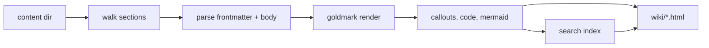

# Rendering pipeline

Rendering is a single pass with no external process at request time.



1. **Walk.** The content directory is read. Root Markdown files form one
   section, and each subdirectory under the root is a section, in that order and
   titles from `--sections`, with any unlisted directory appended
   alphabetically. An unlisted directory's title is its name with hyphens and
   underscores turned into spaces and the first letter of each word upper-cased,
   which is done by character rather than by byte so a non-ASCII name titles
   itself correctly. A directory inside a section is not a section of its own:
   its pages belong to the section above and keep the path in their slug, so
   `guide/setup/install.md` in a `guide` section is served at
   `/wiki/guide/setup/install.html`. The sidebar follows one level of that
   structure: pages that share a first sub-directory under their section are
   grouped under a nested disclosure named from that sub-directory, and its
   `index.md` becomes the group's own heading link. Deeper paths collapse into
   their top group, so the rail stays flat while the tree it shows is two deep.
   A group's pages are the rail's third level: they hang off a hairline rule
   rather than a deeper indent, and a page whose title repeats its group heading
   drops the shared prefix, so the row fits one line at any rail width. A
   section opens one of its groups at a time, so a rail of many groups stays
   short. `nav` in a page's frontmatter overrides the label the rail shows, for
   a body title too long for the rail. `kicker` renders an eyebrow label above
   the page title, empty on pages that do not set it.
   Markdown is collected at any depth. Files
   and directories whose name begins with a dot are skipped, so a bundle that is
   also a working tree does not render its own `.git`.
2. **Parse.** Each file is split into frontmatter and body. The body is parsed
   with goldmark (CommonMark plus tables, task lists, footnotes). Heading ids
   are assigned from the heading text and made unique within the page. An on-page
   table of contents collects level two only, though every heading still gets
   an id. Level-two headings grow a `#` permalink on hover.
3. **Transform.** Fenced code is highlighted with Chroma into `pre.code.chroma`,
   with a `language-*` class naming the language. A fence with no language is
   escaped into `pre.code` and left unhighlighted. GitHub alert blockquotes
   (`> [!NOTE]`) become callout cards. Mermaid fences pass through as
   `<pre class="mermaid">` for the browser to render.

   The browser draws each diagram into a card: a toolbar naming the type, a
   zoom group and the copy and expand affordances, then the drawing. Every
   type renders at one size, and a diagram opens fitted to the card, so its
   whole shape is visible; the zoom buttons step the scale and the card's
   scroll area takes over. Full screen repeats the drawing, fitted to the
   window, with the same zoom and a drag to pan, and closes on Escape or a
   click on the field around it. A diagram that will not parse becomes a red
   card carrying the parser's message and the source, so the mistake is
   readable where it is written rather than an empty block.

   Footnotes whose label matches a `sources[]` id are rewritten into numbered
   citations to a generated Sources section; see [Sources](#sources).
4. **Index.** Each page is split into heading-anchored text chunks and written
   to `search-index.json`, which the client search modal loads on first use.
   Tags are collected into `tags.json`, a catalogue of display name, tag page
   URL and page count, which the modal fetches only for hash-prefixed queries.
   In a multi-site tree, each wiki keeps its own index and the tree also gets an
   aggregate one at its base: the entries of every wiki that rendered, each
   labelled with the wiki it came from, so a search from any wiki reaches all of
   them. A wiki that was skipped contributes nothing to the aggregate. A content
   root that is itself a wiki is a tree of one, whose index already sits at the
   base; it gets no separate aggregate, so its search reads as one bundle's.
5. **Emit.** In order: the pages, one tag page per tag under `tags/`, the
   bundle's own files under their own paths, so an image resolves and each page
   has its Markdown source beside it, the resolved theme's assets (stylesheet,
   fonts, tokens, the search and diagram clients, favicon), the Mermaid vendor
   bundle when the bundle has a diagram, `search-index.json`, `tags.json`, and
   a `theme.json` recording which theme produced the output. The output
   directory is emptied first, so a page removed from the bundle does not
   linger.

## Themes

A theme is resolved once, before any page is rendered, and the result is
fingerprinted into the `?v=` query on every asset link. Two renders of the same
bundle under different themes therefore differ in that hash, which is what makes
a theme change reach the browser. See
[`reference/themes.md`](../reference/themes.md).

## Links

A link that stays inside the bundle becomes a link to the rendered page. It may
be written relative to the page, `../design/rendering.md`, or from the bundle
root, `/design/rendering.md`. The root form is preferred, because it does not
move when the page does. A link to a file that is not Markdown, such as an image,
becomes a link to that file: every non-Markdown file in the bundle is copied into
the site under the same path, so an asset resolves the way a page does. Dotfiles
and dot-directories are not copied.

A link that escapes the bundle (for example `../../roles/x.yml`) becomes a
`/repo/...` link when `--repo` is set, served from a read-only mount of the
repository root. Without `--repo` the original relative link is kept, since
there is nothing that could serve it.

## Tags

Tags are the only frontmatter that becomes navigation. Each tag chip on a page
links to a tag page, and a query starting with `#` in the search modal searches
tags rather than page text. A tag with no URL form stays an unlinked chip, and
a tag page is never in the search index itself: it is reached through chips and
tag search, not text search.

A tag page opens with the count, the tags that co-occur with it, and a link to
the full catalogue at the bottom. Its listing groups pages by section, with a
control to flatten the groups and one to show deprecated pages, which are
hidden otherwise. Each row carries the title, the type, the description, the
concept path, and the page's other tags. Status badges render from data the
bundle actually carries: draft and deprecated from `status`, stale from
`stale_after`. Trust tiers and dates need `verified` and `generated`
frontmatter no page is required to have, so the page does not guess them.

## Sources

A page declares the material its claims come from in a `sources` list in
frontmatter. Each entry is a followable artifact or a scope descriptor, and
carries an `id` that a footnote can name:

```yaml
sources:
  - id: okf-spec
    resource: https://github.com/GoogleCloudPlatform/knowledge-catalog
    title: The OKF specification
    author: team:knowledge-catalog
    last_modified: 2026-06-30T00:00:00Z
```

A body footnote whose label matches an entry's `id` becomes a numbered citation
linking to a generated `Sources` heading at the end of the page, and the
footnote's own definition is dropped so the material appears once. A repeated
citation reuses its number. Numbers follow the order of the `sources` list, not
the order the claims appear, so the reference list reads the same however the
prose is arranged. An entry with no `id` cannot be cited but is still listed,
because the page declares it.

`resource` decides how an entry resolves. An absolute URL links as written, a
relative path resolves like any other bundle link, and free text, such as a
sentence naming the scope a claim applies to, renders as plain text, since
there is nothing to follow. The link text falls back from `title` to `resource`
to `id`, so an entry is never an empty link.

`author` and `last_modified` are optional signals, and an absolute URL adds its
host. The list shows host, author, then date, and omits whatever is absent
rather than leaving a blank. An RFC 3339 `last_modified` is reformatted for
reading; anything else is shown as written, so a malformed date is visible
rather than silently missing. `usage_count` from the OKF source family is
accepted and not rendered.

The generated heading is an ordinary level-two heading, so it joins the on-page
table of contents, and its id is made unique against the page, since a page may
already link somewhere called `sources`.

The two footnote kinds can share a page: a footnote whose label matches no entry
keeps goldmark's own number and definition. Because the two number
independently, a page mixing them can show one numeral twice. Both links still
resolve; only the numerals collide. [Blocks](../testbed/blocks.md) exercises
every case on one page.

## Print and download

Every page carries its own Markdown as a file beside its HTML, the source the
render read, and links to it from a Download Markdown control under the title.
A synthetic page, such as a tag listing, has no source and no control.

Printing drops to one column and hides what is a control or a jump: the header,
the sidebar, the table of contents, the previous and next cards, the diagram
toolbar and the download link. What reads badly split stays together: a heading
moves to the next page rather than sitting alone at the foot of one, and a
callout, a code block or a diagram stays whole. A table breaks, but its header
repeats on each page, so the columns stay named. A dark screen still prints the
light document, and a printed code block is light with ink text rather than the
on-screen dark surface.

## Trees of wikis

`--multi-site` makes the content directory a tree rather than one bundle. A
directory holding an `index.md` is a wiki, rendered at the path it sits at under
the base; any other directory is a group, and the render writes it an index of
the wikis and groups directly inside it. A wiki's sub-directories are its
sections, so the tree stops at a wiki. A group index renders through the theme
with no sections of its own, so it keeps the header and the styling but has no
sidebar and no contents. The output mirrors the tree, which is what lets one
render and one `serve` publish a whole collection.

Search is the one thing that spans the tree. Every wiki and every group fetches
the aggregate index at the tree base, and the client groups the hits under a
heading per wiki and can narrow to the current wiki. A tree of one, whose root
is itself a wiki, has no aggregate and no per-wiki headings. Tags stay per wiki,
as does the `#tag` namespace, since a tag page is a page of the wiki that carries
it.

## Caching

Every page links its stylesheet and scripts with a content-hash `?v=` query, and
the server sends `Cache-Control: no-cache, must-revalidate`. A re-render
therefore always reaches the browser, which matters while authoring. The hash
covers the resolved theme's bytes, so an override that changes a stylesheet
busts the cache even though the file name is the same.

The theme's token, font and layout layers are three stylesheets linked from the
head rather than `@import`-ed into one: an `@import` is discovered only after its
parent stylesheet parses, so the browser would wait on two serial round trips
before it could paint. A page link is written as `slug + ".html"`, so a section's
home page is requested as `.../index.html`; the server serves that file in place
rather than answering with the 301 that `http.FileServer` would, so an index link
does not cost a redirect before the document.

Every response also carries an `ETag` from the file's bytes, beside the
`Last-Modified` the file server sends. A re-render rewrites the whole tree and so
moves every file's modification time; without an `ETag` an unchanged asset would
be answered with a full `200` on the next request. The content hash does not move
when only the time did, so an unchanged file revalidates to a `304`.

The wordmark's mark is an `` in the header, so the browser would discover it
only after the stylesheets and the body parse and it would paint a step behind
everything else. A `rel="preload"` in the head starts it beside the CSS, at high
priority, and the `` requests the same versioned URL so the hint is a cache
hit rather than a second fetch.

A wiki of a tree that cannot be read is skipped and reported, not fatal. A tree
assembled from linked checkouts is exactly where a link goes stale, and taking
every wiki down for one is worse than publishing the rest. The skipped wiki
leaves no output, so nothing serves it, and its card is left off the group index
rather than linking to a page that is not there. The reason names the wiki and
the failure; `render` and the reload path both print it.
