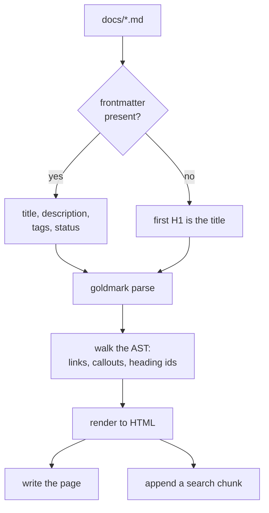
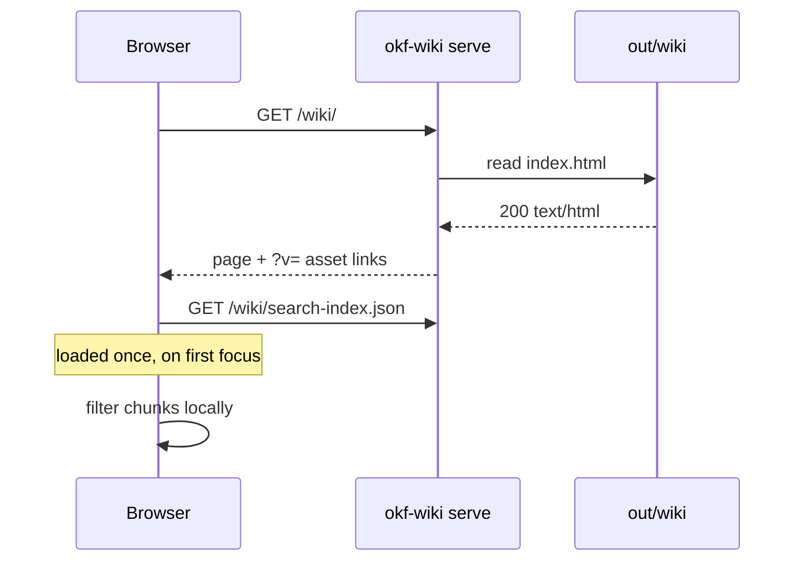
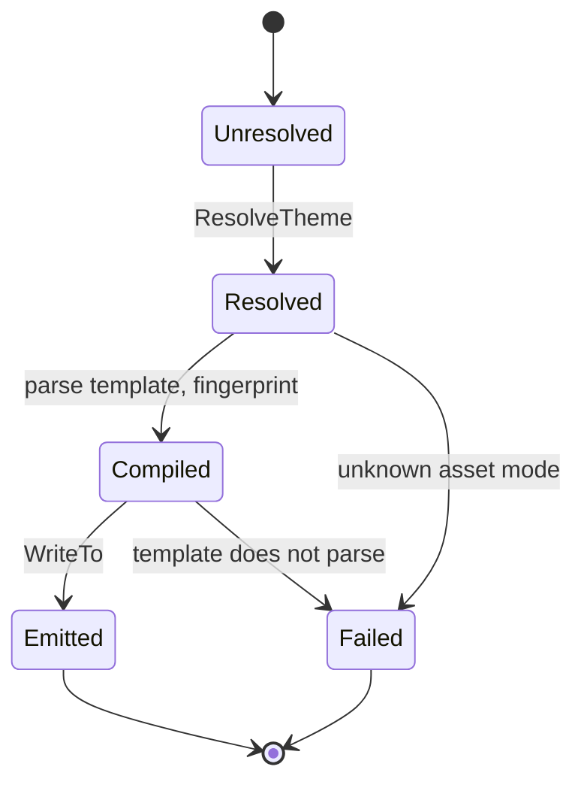
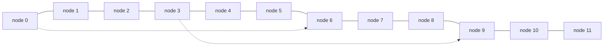

# Diagrams

A `mermaid` fence is not highlighted. It passes through as a `pre.mermaid` block
that the diagram runtime picks up in the browser, so a diagram only appears once
that runtime has loaded. Everything below is drawn client side, which is why the
page is readable with the runtime absent and the diagrams are not.

## Flowchart



## Sequence



## State



## Wide, to check the lightbox

A diagram wider than the reading column is the case the full-screen viewer
exists for. Click any diagram on this page to open it.



## Syntax that must not break the page

An invalid diagram leaves its source visible rather than blanking the block,
so the mistake is readable in place.

```mermaid
this is not valid mermaid
```
