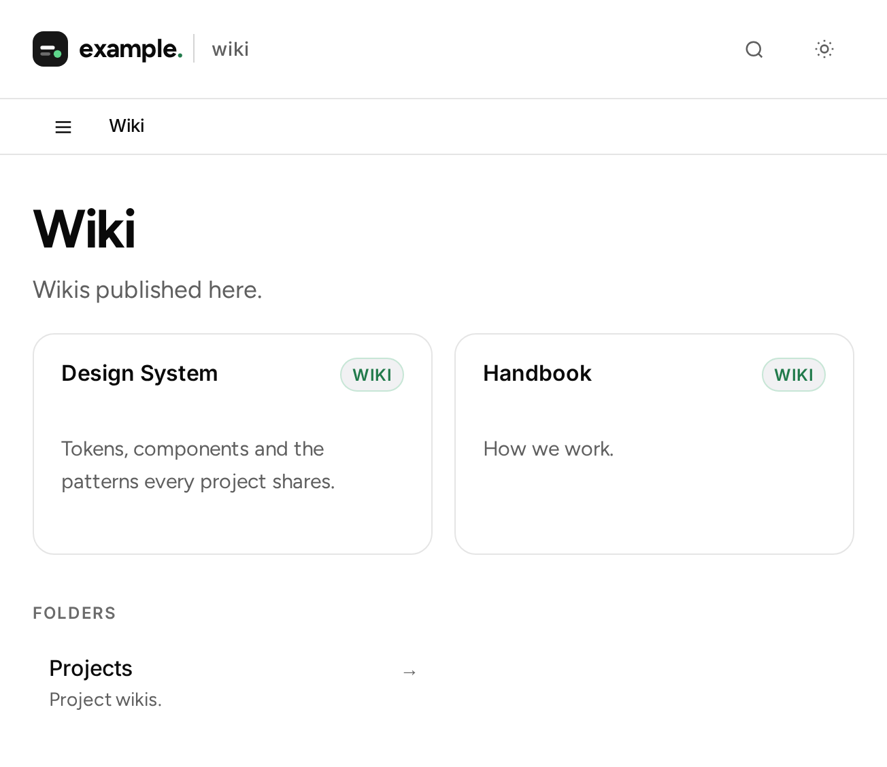
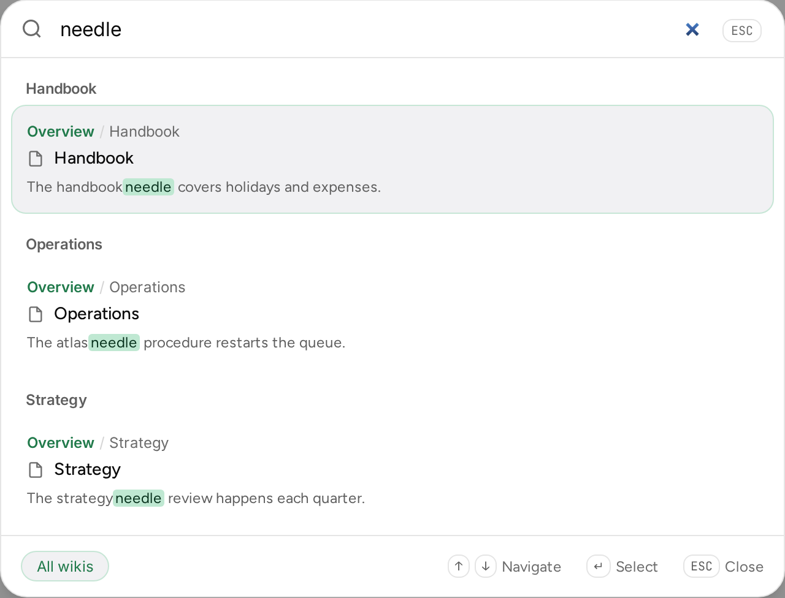
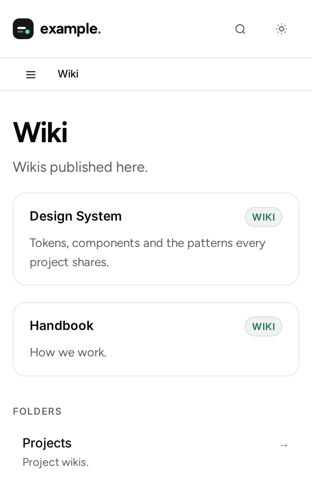

# A multi-site tour

This page shows what `--multi-site` produces, using a small example tree. A
`projects` folder holds an `atlas` folder with two wikis, `operations` and
`strategy`, and two more wikis sit at the top level, `handbook` and
`design-system`:

```text
content/
  projects/
    atlas/
      operations/
      strategy/
  handbook/
  design-system/
```

## The index of a group

A group is given an index listing the wikis directly inside it as cards, with
the folders that hold wikis below them. The cards are one height: a title
reserves two lines and a description three, so a short card lines up with a
taller neighbour and every row holds one height.



## Search across the tree

Ctrl+K searches the whole tree rather than only the wiki you are in. Results are
grouped under a heading per wiki, so a hit in a sibling wiki is obvious, and the
All wikis / This wiki toggle in the footer narrows the list to the current wiki.



## The header belongs to the deployment

The brand mark and the wordmark link to the tree index, so they mean the
deployment home from any depth rather than the top of the wiki you happen to be
in. The breadcrumb reads the trail from the tree root down to the current page:
each folder links to that group's index and the wiki name links to the wiki's own
home.


## On a phone

On a phone the cards are a single column. There is nothing beside them to align
with, so each card sizes to its content and shows its full description rather
than reserving lines for a neighbour.


